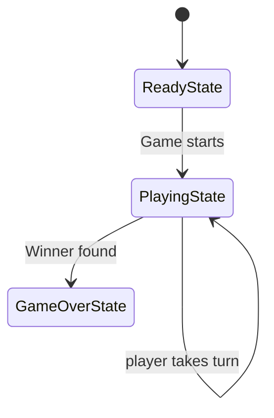

# Dice Game Architecture 

## Introduction 

This project implements a configurable turn based dice board game using Java and SpringBoot. The software was originally designed using an object-oriented structure before being refactored into clean architecture using ports and adapters. 
The aim of the project was to create a maintainable and extensible software product capable of supporting multiple variations while remaining separating core game logic from infrastructure and external technologies. 
The system also supports save and replay functionality, event-driven behavior and dependency injection using SpringBoot. Design patterns and solid principles were applied throughout implementation to prove functionality and reduce coupling.  

## Variations and advanced features 

The project was designed to support multiple gameplay variations through configurable factories and rule composition. 

### Normal game 
The normal game provides the base implementation of the game using a standard board and two players. 
### Bounce game 
The bounce variation introduces a 'BounceRule' which changes player movement behavior when a player overshoots the final board position. 
### Hit game 
The hit game variation familiarizes player interaction using the 'HitRule' allowing gameplay behavior to change when players collide on the same board position. 
### Wormhole game 
The wormhole variation introduces teleportation behavior using the WormholeRule which would allow players to move from one position to another depending on the square they land on. 
### Large board game
The large board variation increases the board sizer and number of players. different player paths are generated dynamically to support the larger game configuration. 
### Combined game
The combined variation demonstrates extensibility by combining the multiple gameplay rules together within a single game run or instance. 
### Save and replay 
The product includes save and replay functionality implemented using clear architecture principles and an in-memory database Map system. The completed games are converted into "GameRecord" 
objects which act as value objects storing the important replay information for a completed game. 
Each 'GameRecord' stores: 
- Game type 
- Board size 
- number of players 
- Dice roll history

The save system uses an 'InMemoryDatabase' together with a GameDatabaseAdapter to storage responsibilities from, the core application logic. 
The save and replay use cases depend on abstraction interfaces rather than concrete database implementations following the Dependency inversion Principle. 
Replay functionality reconstructs the correct game variations using the stored 'GameType' and recreates the appropriate 'GameFactory'. The stored Dice roll history
is then replayed through the existing game logic using 'playTurnWithFixedRoll()', This allows completed games to be replayed without generating new random dice values. 
the use of an In-memory adapter also makes the architecture extensible because the storage implementation could later be replaced with alternative mechanisms such as JSON or file-based storage without modifying the core usecase logic.

## Design Patterns 

### Factory Pattern 

The Factory Pattern is implemented through the 'GameFactory' abstraction and concrete factory implementations  such as 'NormalGameFactory', 'BounceGamefactoy', 'HitGameFactory', 'WormholeGameFactory' and 'CombinedGameFactory'. 
Each factory is responsible for creating a different game configuration which includes: 
- Board size 
- Players 
- Game play rules 
- Dice Behavior 
- Win strategies 

This removes configuration logic from the main 'Game' class and allows new gameplay variations to be introduced without modifying the core game logic. Factories are selected at runtime using the 'GameType', enumeration together 
with the 'GameFactoryProvider'.
### Strategy Pattern 
Strategy patterns are used to support variation in gameplay behavior at runtime. Behavior is enclosed behind interfaces allowing different implementations to be swapped without modifying dependant classes. 
Examples include: 
- WinStrategy 
- PlayerSelector

Different strategies can be injected into the game through the factory system, which improved the flexibility of the system. 

### State Pattern
The State Pattern is used to manage gameplay through the 'GameState' abstraction and other concrete states including: 
- 'ReadyState'
- 'PlayingState'
- 'GameOverState'

The current state controls how the game behaves during execution and allows behavior to change dynamically as the game progresses. 
### State Machine Diagram 


### Observer Pattern 
The observer Pattern is implemented through the event and the observer system used by the 'TurnHandler', Game events such as
dice rolls, player movement and turn updates are communicated to observers which includes the 'ConsoleObserver'. 
This improves the separation of responsibilities because output handling is separated from the game play logic. The observer 
system also improves the scalability because additional observers could later be added without modifying the turn handling system itself. 

### Adapter pattern 
The adapter pattern is used within the infrastructure layer of the architecture through classes such as the 'GameDatabaseAdapter' class. 
The Adapter converts the 'InMemoryDatabase' implementation into the interfaces required by the play and replay use cases. This allows 
the use cases to depend on abstractions instead of concrete storage implementations supporting the Dependency Inversion Principle and 
improves maintainability throughout the system. 

## SOLID Principles 
Several SOLID Principles were applied throughout the implementation to improve maintainability and reduce coupling between components. 
### Single Responsibility Principle (SRP)
Classes where designed with focused responsibilities rather than the functionality being combined into a single class. 
Examples: 
- 'GameCliAdapter' which handles console interaction. 
- 'GameDatabaseAdapter' handle storage responsibilities. 
- 'GameRecord' stores the replay data. 
- 'GameFactory' implementations creating game configurations. 
- 'Turn handler' manages turn executions. 

Separating responsibilities in this way improves the maintainability if the system because changes to one area of the system 
is less likely to affect unrelated parts of the application. 

### Open Closed Principle (OCP)
The architecture is open for extension but closed for modification. New Game play Variations can be added by creating additional 
rules and factory implementations without modifying the core 'Game' class. 

Example: 
- 'BounceRule'
- 'HitRule'
- 'Wormhole' 
- additional 'GameFactory' implementations 

It improves the system because new gameplay behavior can be introduced with minimal impact on existing code. 

### Dependency Inversion Principle (DIP)
As we know the use cases depend on abstractions instead of  concrete infrastructure implementations. Interfaces like: 
- 'GameFactoryProvider'
- 'playgame.Required' 
- 'replaygame.Required'

This allows infrastructure implementations to be injected through SpringBoot dependency injection. 
It reduces further mixing of the application layer and infrastructure layer while improving testability. 

### Interface Segregation Principle (ISP)
- The Play use case has separate 'Provided' and 'Required' interfaces. 
- The Replay use case also has separate 'Provided' and 'Required' interfaces. 

This keeps dependencies smaller and ensures classes only depend on operations they actually require. 

## Clean Architecture, Ports and Adapters
The project was refactored to follow a clean architecture style with ports and adapters. The main goal 
was to keep the application use cases separate from infrastructure details such as input/output, SpringBoot configuration 
and in-memory storage. 

The application is split into separate layers: 
- 'domain' contains the core game logic such as 'Game', 'Player', 'Board', rules states strategies and factories. 
- 'use case' contains application actions such as playing and replaying a game.
- 'infrastructure.driving' contains the entry point adapter, 'GameCliAdapter'. 
- 'Infrastructure.driven' contains adapter implementations such as 'GameDatabaseAdapter', 'InMemoryDatabase' and
SpringGameFactory. 

The use case expose 'Provided' interfaces and depend on 'Required' interfaces. This means the application logic does not
directly depend on the storage implementation. Instead, the concrete adapter is supplied by SpringBoot in 'AppConfig'. 

```mermaid
flowchart TB

    subgraph Driving["Driving Infrastructure"]
        CLI["GameCliAdapter"]
    end 
    
    subgraph Usecase["Use case Layer"]
        PlayProvided["<<interface>>" playgame.Provided"]
        ReplayProvided["<<interface>> replaygame.Provided"] 
        
        PlayUsecase["PlayGame Usecase"]  
        ReplayUsecase["ReplayGame Usecase"] 
        
        PlayRequired["<<interface>> playgame.Required"] 
        ReplayRequired["<<interface>> replaygame.Required"] 
        FactoryProvider["<<interface>> GameFactoryProvider"] 
    end
    
    subgraph Domain["Domain Layer"] 
        Game["Game"] 
        GameFactory["GameFactory"] 
        GameType["GameType"] 
    end 
    
    subgraph Driven["Driven Infrastructure"]
        DatabaseAdapter["GameDatabaseAdapter"] 
        InMemoryDatabase["InMemeryDatabase"] 
        SpringFactoryProvider["SpringGameFactoryProvider"] 
    end 
    
    CLI --> PlayProvided
    CLI --> ReplayProvided    
    
    PlayProvided --> PlayUsecase
    ReplayProvided --> ReplayUsecase 
    
    PlayUsecase --> Game
    PlayUsecase --> GameRecord
    PlayUsecase --> playRequired
    PlayUsecase --> FactoryProvider
    
    ReplayUsecase --> Game
    ReplayUsecase --> ReplayRequired
    ReplayUsecase --> FactoryProvider
    
    Game --> GameFactory
    GameRecord --> GameType
    
    DatabaseAdapter -.implements.-> PlayRequired
    DatabaseAdapter -.implements.->ReplayRequired
    DatabaseAdapter --> InMemoryDatabase
    
    SpringFactoryProvider -.implements.-> FactoryProvider
    SpringFactoryProvider --> GameFactory         
```
This design follows the dependency inversion principle 
because the use cases depend on interfaces rather than concrete infrastructure classes. 
For example 'playgame.Usecase' depends on 'playgame.Required' while 'GameDatabaseAdapter' provides the concrete implementation 
using 'InMemoryDatabase'. 
SpringBoot acts as the dependency injection container and assembles the application in 'AppConfig'. This allows volatile
dependencies such as the concrete 'GameFactory' implementation and storage adapter to be changed through configuration
rather than modifying the use case or domain logic. 

## Evaluation 
Overall, I believe the final implementation is significantly more maintainable than the original version of the project. 
Refactoring software into a clean architecture structure improved separation between domain logic, use cases and infrastructure 
responsibilities. The use of ports and adapters reduced coupling and allowed features like save and replay to be implemented 
without direct depending on infrastructure classes inside the application logic. One of the strongest parts of the implementation 
is the flexibility of the game variations. 

